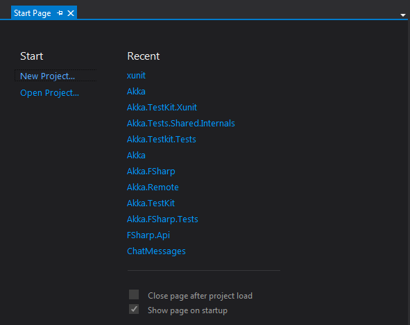

# Startpage
The normal start page in Visual Studio is rather bloated. This is a clean start page that only lists the latest projects.

## Install
- Download [Clean.xaml](Clean.xaml) 
- Copy it to `userprofile%\My Documents\Visual Studio 2013\StartPages`(It will work with Visual Studio 2012 as well)
- In Visual Studio open _Tools_ > _Options_ > _Environment_ > _Startup_
	- At Startup: **Show Start Page**
	- Customize Start Page: Select **Clean.xaml** 

Next time you start Visual Studio, it will show the start page. You can also show it via the menu: _View_ > _Start Page_

## Optional
There is a section in Clean.xaml that has been commented out. Uncomment this section to show two more buttons: _Open Source Control Explorer_ and _Connect to Team Foundation Server..._
